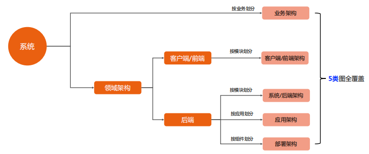

# 极客时间《如何画好架构图》（李运华）学习笔记

## 1 软件架构4R

- Rank（顶层架构）：架构是分层的
- Role（组成角色）：系统包含哪些角色
- Relation（角色关系）：角色之间的联系
- Rule（运作规则）：角色如何协作完成系统功能

汽车的案例：

**注：** 连线在软件中代表协议、通道、连接等，在硬件中代表连接线、信息通路等。

- 架构分层：层级的深度和系统复杂度相关，一般3~4级基本够用
- 主要思想：**自顶向下，逐步细化**

## 2 `4+1`视图

- 逻辑视图：系统提供给用户的功能，对应UML的`class`和`state diagrams`
- 处理视图：系统的处理过程，对应UML的`sequence`和`activity diagrams`
- 开发视图：程序员角度看系统的逻辑组成，对应UML的`package diagrams`
- 物理视图：系统工程师角度看系统的物理组成，对应UML的`deployment diagrams`
- 场景视图：用户角度看系统需要实现的需求，对应UML的`use case diagrams`

**注：** 4+1视图用得不多，原因是架构复杂度增加、绑定UML图、理解困难

## 3 多个角度描述架构

架构图分类：静态架构图（客户端架构、系统架构、应用架构、部署架构等）、动态架构图（系统序列图）

- 静态架构图分类

> **思考题：** 为什么客户端和前端都只需要按模块划分？  
> **答：** 客户端不存在按应用划分，客户端是单体系统

以钱包系统的架构为例，针对每一个架构图进行描述。

### 3.1 业务架构（静态架构图）

描述系统对用户提供了什么业务功能，类似于4+1视图的场景视图

**注：**
1. 通过不同颜色（建议不超过3种）来标识业务状态，例如是否成熟，质量，已上线/规划中；
2. 业务分组管理，分组的标准是“相似性”。
3. 分组是为了业务域。

### 3.2 客户端/前端架构（静态架构图）

客户端和前端的领域逻辑架构，类似于4+1视图的逻辑视图。

**注：**
1. 通过不同颜色来标识不同角色；
2. 通过连接线来表示关系；
3. 按照依赖关系自顶向下分层，注意和4R架构的分层进行区分。

### 3.3 系统架构（静态架构图）

后端的逻辑架构，也称`后端架构`或`技术架构`。

以Mongodb架构的分片架构为例：

**注：**
1. 通过不同颜色来标识不同角色；
2. 通过连接线来表示关系。
3. 连接线可用于区分长期关系和临时关系、通信含义、数据与控制、同步和异步、TCP和UDP等。

> **思考题：** 为什么后端逻辑架构叫`系统架构`？  
> **答：** 系统复杂部分都在后端，后端是主体、核心。

以钱包的复杂系统为例，使用2张图表示：功能示意图用L0+L1表示、交互示意图。

**注：** 单向箭头表示依赖关系

### 3.4 应用架构（静态架构图）

描述后端系统由哪些应用组成。

**注：**
1. 通过不同颜色来标识不同角色。
2. 通过连接线来表示关系。
3. 按照典型业务处理逻辑排列。

### 3.5 部署架构（静态架构图）

描述后端系统具体如何部署的，对应4+1视图的物理视图。

**注：** 用图标代替区块。

### 3.6 系统序列图（动态架构图）

系统序列图是描述核心业务场景下，系统的各个业务角色如何交互来实现这个业务功能。

**注：**
1. 系统序列图会有很多张。
2. 系统序列图用UML 序列图（UML工具）来画，用于描述核心功能的实现规则（Rule）。

> 思考题：为什么系统序列图只画核心的业务场景？
> 答：因为核心的业务场景变动不大，其他辅助场景不会影响架构设计，并且在架构设计阶段，辅助场景还没有构思完全。

## 4 课后交流

1. 解决方案架构师和业务架构师有什么区别？  

**答：** 解决方案架构师在ToB领域比较常见，由于业务差异化，熟悉客户业务，熟悉自己公司的产品，基于客户特点和技术水平，设计定制化、针对性的解决方案。  
业务架构师是公司内部岗位，更多的时候是站在自己公司的产品发展角度， 规划整个产品和业务的演进、变化、重构和新业务的构思。

2. 业务不等于功能？

**答：** 这个很好理解，以ATM机为例，密码验证属于功能，取款属于业务。  
区分：业务是对用户有价值的服务；功能是为了实现业务，系统要提供的能力。业务是系统提供的服务，功能是系统需要具备的能力。

3. 业务架构师和产品经理的职责有重合吗？

**答：** 业务架构师就是高级别的产品经理，一般来说P8或P9叫做业务架构师。

4. 给不懂技术的领导要如何讲明白系统架构？

**答：** 可使用业务架构和系统架构图讲解即可。

5. 正常设计一个新系统，都需要绘制哪些架构图？

**答：** 每个图都需要画。

6. 如何进行架构分享？如何确定分享的粒度？

**答：**  
（1）岗位定位：在该岗位的工作范围内，进行架构拆分。  
（2）确定听众级别（见人下菜）：如果本职是P9，给P7的人员培训系统架构，判断P7人员的关注点。

7. 晋升P7需要画出5张图吗？

**答：** 一般来说，不用全部画，画好并讲解应用架构图即可。

8. 晋升P8需要绘制哪些图？

**答：** 首先需要画业务架构，向不同领域的评委介绍业务；再者需要画整个系统的系统架构，P8人员需要有端到端的视角；需要画应用架构，也需要画部署架构。